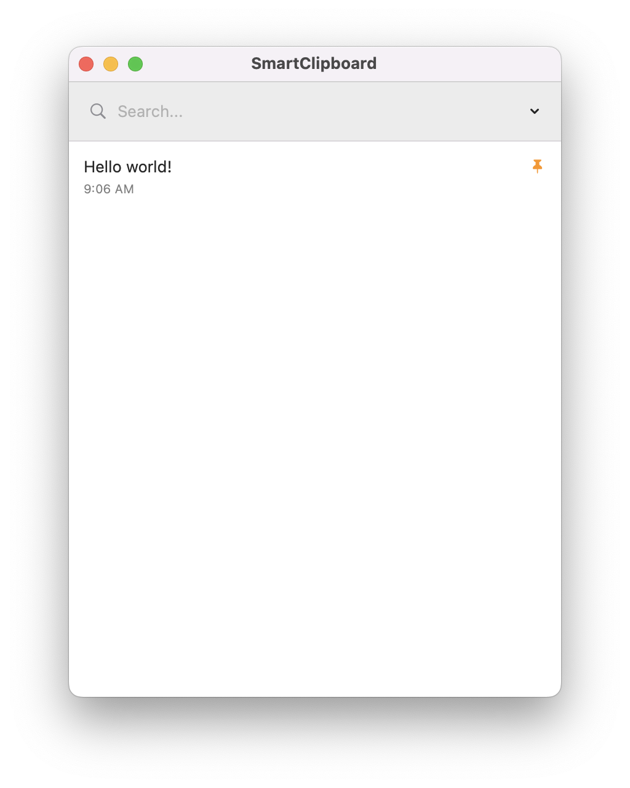

# SmartClipboard

[English](#english) | [繁體中文](#繁體中文)

---

<a name="english"></a>
## English

SmartClipboard is a lightweight and efficient clipboard manager designed specifically for macOS. It monitors your clipboard in the background, allowing you to easily access, search, and manage your copy history.

### ✨ Features

- **Background Monitoring**: Automatically records text copied to the clipboard.
- **Global Shortcut**: Press `Command + Control + V` to quickly toggle the clipboard window.
- **Pin Items**: Pin important items to keep them at the top and prevent them from being cleared.
- **Auto-Paste**: Double-click an item or click the copy button to automatically paste it into your current active application.
- **Search & Filter**: Quickly find historical records using the built-in search bar.
- **Edit & Delete**: Modify or remove clipboard history as needed.
- **Floating Window**: The window stays on top for quick access and hides automatically when not in use.
- **Persistence**: Your history and pinned items are saved across app restarts.

### 🚀 Getting Started

#### Prerequisites
- macOS 11.0 or later
- Xcode 12.0 or later (for building from source)

#### Installation
1. Clone the repository:
   ```bash
   git clone https://github.com/yourusername/SmartClipboard.git
   ```
2. Build:
   ```bash
   swiftc -o SmartClipboardApp_Exec ClipboardItem.swift ClipboardManager.swift ContentView.swift SmartClipboardApp.swift -framework SwiftUI -framework AppKit -framework Combine -framework Carbon
   ```
4. Run:
   `./SmartClipboardApp_Exec`

### ⌨️ Usage

- **Toggle Window**: `Command + Control + V`
- **Copy & Paste**: Double-click an item in the list.
- **Manage**: Hover over an item to see Pin, Edit, and Delete options.
- **Clear**: Use the menu in the top-right to clear all unpinned items.

---

<a name="繁體中文"></a>
## 繁體中文

SmartClipboard 是一款專為 macOS 設計的輕量級智慧剪貼簿管理器。它在後台監控您的剪貼簿，讓您輕鬆存取、搜尋和管理您的複製歷史記錄。

### ✨ 功能特點

- **後台監控**：自動記錄複製到剪貼簿的文字內容。
- **全局快捷鍵**：按下 `Command + Control + V` 即可快速呼叫或隱藏剪貼簿視窗。
- **置頂功能**：將重要項目置頂，確保它們始終在頂部且不會被自動清理。
- **自動貼上**：雙擊項目或點擊複製按鈕，即可自動將內容貼上到當前活動的應用程式中。
- **搜尋與篩選**：內建搜尋欄，助您快速找到歷史記錄。
- **編輯與刪除**：根據需要修改或移除剪貼簿歷史。
- **懸浮視窗**：視窗保持在最上層，方便快速存取，並在不使用時可隱藏。
- **持久化儲存**：應用程式重啟後，您的歷史記錄和置頂項目仍會保留。

### 🚀 開始使用

#### 環境要求
- macOS 11.0 或更高版本
- Xcode 12.0 或更高版本（用於從原始碼編譯）

#### 安裝步驟
1. 複製此儲存庫：
   ```bash
   git clone https://github.com/yourusername/SmartClipboard.git
   ```
2. 構建:
   ```bash
   swiftc -o SmartClipboardApp_Exec ClipboardItem.swift ClipboardManager.swift ContentView.swift SmartClipboardApp.swift -framework SwiftUI -framework AppKit -framework Combine -framework Carbon
   ```
4. 運行:
   `./SmartClipboardApp_Exec`

### ⌨️ 使用方法

- **切換視窗**：`Command + Control + V`
- **複製並貼上**：在清單中雙擊項目。
- **管理項目**：將滑鼠懸停在項目上，即可看到置頂、編輯和刪除選項。
- **清理**：使用右上角的選單清理所有未置頂的項目。

---

### 🛠 Tech Stack / 技術棧

- **SwiftUI**: User Interface
- **AppKit**: System integration (Clipboard monitoring, Global events)
- **Combine**: Reactive state management
- **UserDefaults**: Data persistence
